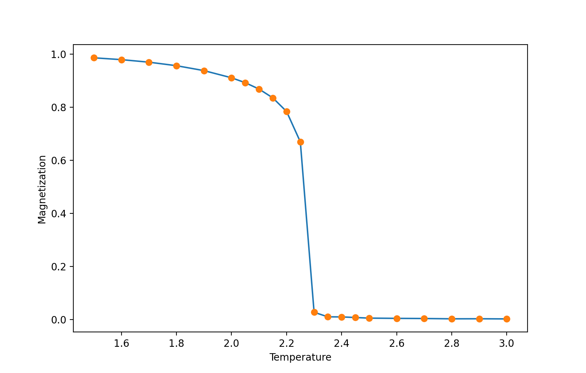
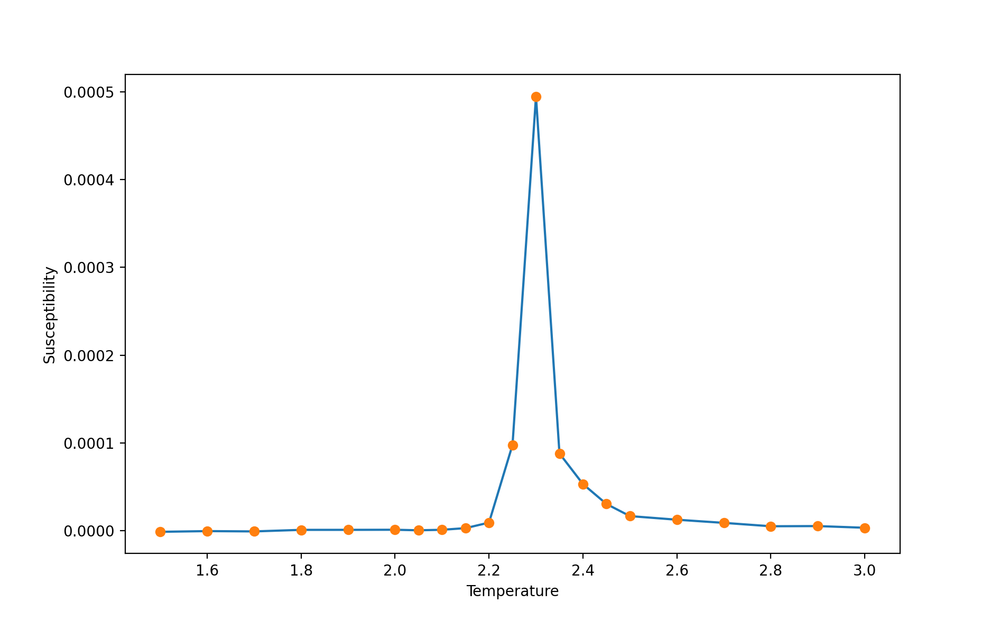
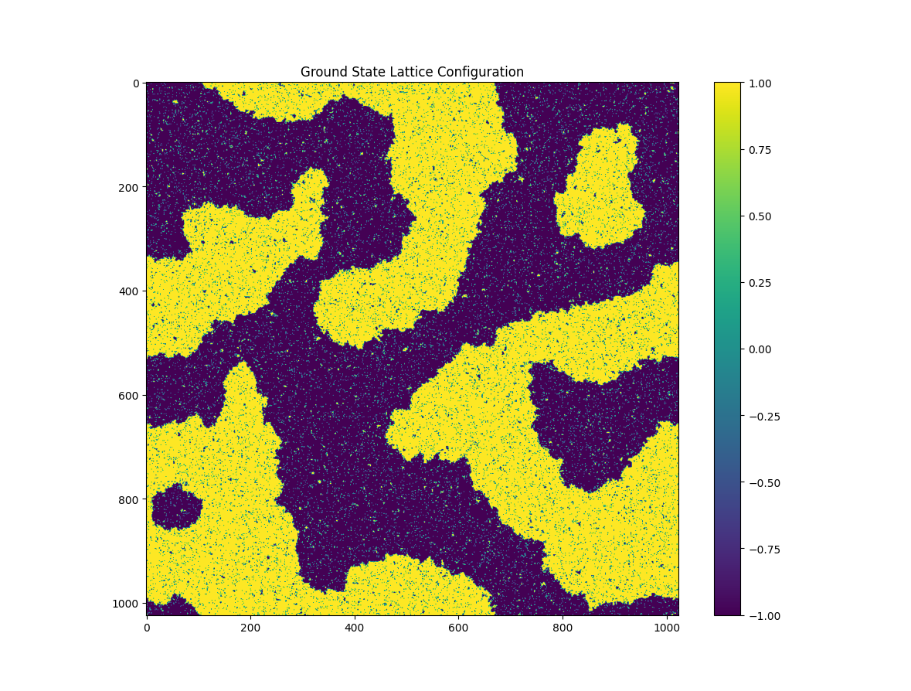

## Accelerating Monte Carlo simulations of 2D Ising Model using Nvidia GPU

# Usage

Compile

`ncvv ising_gpu.cu -o ising -std=c++11 -lcurand`

Run
`./ising -l 1024 -s 200000 -m 1000`

Options: 

~~~
    -l: Specify the size of 2D lattice

    -t: Specify the targeting temperature 
    
    -s: Specify the Monte Carlo sweep for equilibration
    
    -m: Specify the Monte Carlo sweep for measurement
    
    -f: 1 for writing spin configuration to file. Default: 0 
~~~
       
   

# Results

Magnetization as a function of temperature

Susceptibility as a function of temperature

A snapshot of spin configuration in Monte Carlo simulation. 

